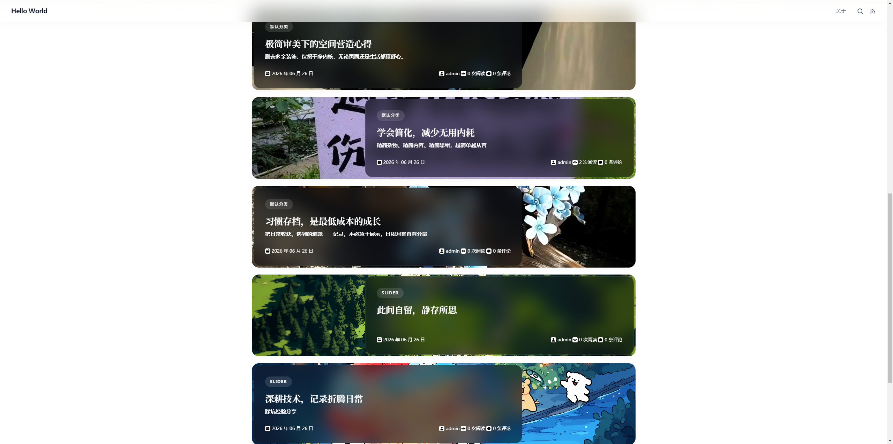
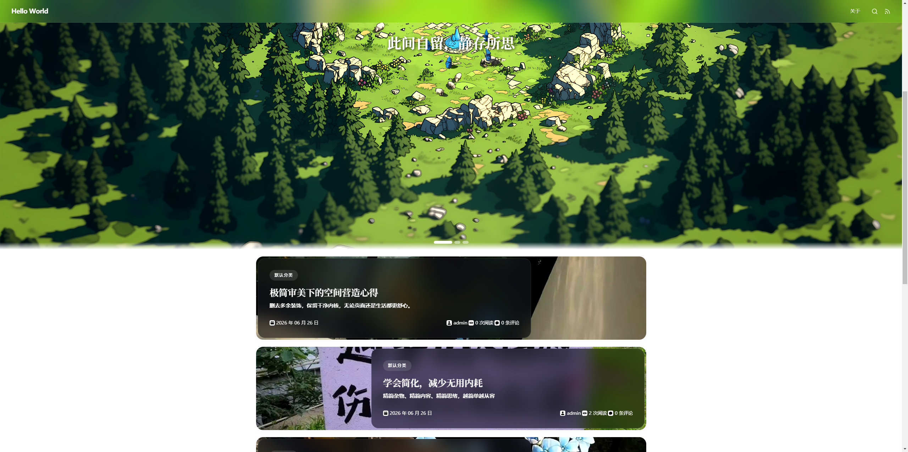

# TamdBlog v1

#### 项目介绍
* TamdBlog是一款基于Typecho打造的专属主题，它的设计永远走在时代前沿！
* [演示地址](http://code.gsav.cn/TamdBlogv1.0.0/)
* [项目文档](https://blog.gsav.cn/244.htm)
---

#### 前言
* 主题任何人都可以修改
* 请保原版权信息
* 遵循GPLv2协议
* 根据协议修改后，即便商用也必须开源并保留版权信息

#### 安装教程

1.  首先打开[Typecho官网](https://typecho.org/download)下载最新版的系统文件
2.  创建你的网站根据教程安装Typecho[安装教程](https://docs.typecho.org/install)
3.  完成上一步的安装后来这里下载主题文件
4.  找到Typecho洗头到根目录找到路径/usr/themes/后，把上一步下载的主题文件在这里面解压（如果是在非官方渠道下载的需要检查一下解压后的主题文件是否有嵌套，正常的是文件夹打开后便可以看见文件，不正常的是打开后发现里面还是一个文件夹）
5.  解压完成后打开你的网站后台（你的域名/admin）找到菜单->控制台->外观->网站外观->可以使用的外观，然后在这个主题列表中找到TamdBlog并启用后即可

#### 操作手册
* 幻灯片默认不存在，如果你需要幻灯片需要先创建一个分类，分类名称默认是slider，你可以在网站外观中修改，然后你需要写两篇文章标题便是幻灯片标题，内容就是幻灯片描述，幻灯片的图片需要你在文章中上传图片附件或者插入图片链接，他会默认读取文章的第一张图片

# 版本更新
#### v1.0.2
1. 评论新增表情包功能
2. 调节了页面的布局
3. 废弃系统自带头像函数，使用自定义头像源
4. 修改了文页面样式
5. 更新了安全补丁
6. 更新了版本号
#### v1.0.1 
1. 更新的自动更新接口，废弃手动下载安装包解压烦人操作
2. 更新了版本号😨
