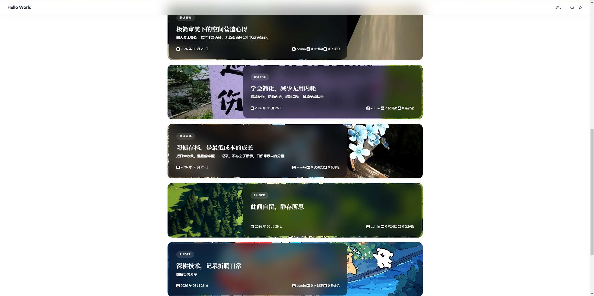
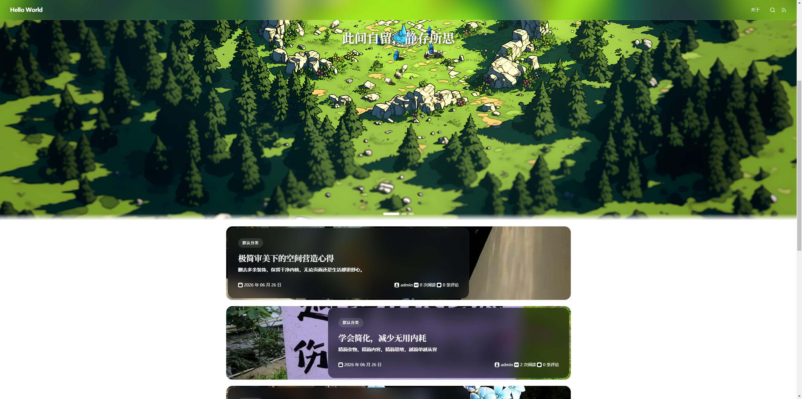

# TamdBlog v1

#### 项目介绍
* TamdBlog是一款基于Typecho打造的专属主题，它的设计永远走在时代前沿！
* [演示地址](http://code.gsav.cn/TamdBlogv1.0.0/)
* [项目文档](https://blog.gsav.cn/244.htm)
---

#### 前言
* 主题任何人都可以修改
* 请保原版权信息
* 遵循GPLv2协议
* 根据协议修改后，即便商用也必须开源并保留版权信息

#### 安装教程

1.  首先打开[Typecho官网](https://typecho.org/download)下载最新版的系统文件
2.  创建你的网站根据教程安装Typecho[安装教程](https://docs.typecho.org/install)
3.  完成上一步的安装后来这里下载主题文件
4.  找到Typecho洗头到根目录找到路径/usr/themes/后，把上一步下载的主题文件在这里面解压（如果是在非官方渠道下载的需要检查一下解压后的主题文件是否有嵌套，正常的是文件夹打开后便可以看见文件，不正常的是打开后发现里面还是一个文件夹）
5.  解压完成后打开你的网站后台（你的域名/admin）找到菜单->控制台->外观->网站外观->可以使用的外观，然后在这个主题列表中找到TamdBlog并启用后即可

#### 操作手册
* 幻灯片默认不存在，如果你需要幻灯片需要先创建一个分类，分类名称默认是slider，你可以在网站外观中修改，然后你需要写两篇文章标题便是幻灯片标题，内容就是幻灯片描述，幻灯片的图片需要你在文章中上传图片附件或者插入图片链接，他会默认读取文章的第一张图片

# 版本更新

#### v1.0.5
1. 更改幻灯片的使用方法：
新版本的幻灯片废弃了使用分类文章的方法，直接跟随主流，在后台可以直接设置幻灯片（图片链接、标题、描述、跳转链接【留空则默认不跳转】，新的方法杜绝了开启幻灯片时没设置幻灯片分类导致页面404的问题）
2. 废弃了文章第一张图片自动隐藏函（配合【1.】因为原本的幻灯片和特色图片是读取文章的第一张图片）
3. 修复了首页文章列表文字挤压遮挡的问题
4. 增加了本地随机图片
5. 增加了文章背景
6. 优化了移动端菜单栏太简易的问题（新增黑色遮罩层，点击收回菜单）
7. 新增文章页面美化部件参考[文章部件使用工具/文档][5]
8. 新增文章标签美化（代码高亮、代码框、引用、h1、h2、视频、图片、音频等）
9. 新增导航栏样式选择，暂时只有两个，以后会增加更多
10. 新增文章的特点图片选择，因为废弃了选文章第一张图片为特色图片、幻灯片的方法，这次直接在写文章的时候就可以在新增字段上填入特色图片链接，留空则使用本地随机图片【4.】
11. 修改了主题封面，不要更新好找不到啦哈哈哈
12. 后台的主题设置页面有惊喜！
13. 新增了后台修改设置内容的提示保存
14. 重构了后台文件结构
#### v1.0.4
1. 趋于稳定
2. 解决了依赖没有安装上导致安装发生500的问题
3. 还更新了啥俺忘了慢慢发现吧
4. 马上发布1.0.5 
#### v1.0.3
1. 更新了文章列表的特色图片，不再只显示图片的边角，而是完整的显示
2. 去掉了文章列表底部一些不重要的信息保持页面正常排版不臃肿
3. 增加了文章列表底部mate信息的图标样式在后台可以切换
4. 调整了文章列表底部mate信息的图标与文字的对齐度
5. 增加了对ip2region的支持
6. 增加了评论区发送人的位置信息
7. 增加了评论区回复框在手机端的适配，防止挤压变形
8. 增加了幻灯片的样式动画，可以通过后台设置幻灯片的样式
9. 增加了字体思源宋体，使页面更加优雅，后台设置cdn路线选择
10. 图片增加通透路径了，高斯模糊增加了GPU硬件加速防止卡顿
11. 增加了小组件模块，后续会添加更多有趣组件
#### v1.0.2
1. 评论新增表情包功能
2. 调节了页面的布局
3. 废弃系统自带头像函数，使用自定义头像源
4. 修改了文页面样式
5. 更新了安全补丁
6. 更新了版本号
#### v1.0.1 
1. 更新的自动更新接口，废弃手动下载安装包解压烦人操作
2. 更新了版本号😨
